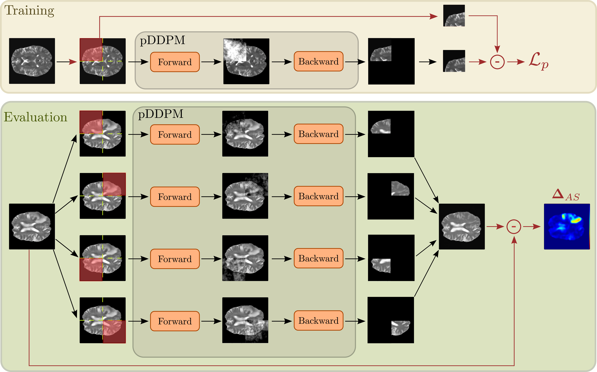

# patched-Diffusion-Models-UAD
Codebase for the paper [Patched Diffusion Models for Unsupervised Anomaly Detection](https://arxiv.org/abs/2303.03758) accepted at MIDL23.

## Graphical abstract

## Data
We use the IXI data set, the BraTS21 data set and the MSLUB data set for our experiments. 
You can download/request the data sets here:

* IXI: https://brain-development.org/ixi-dataset/
* BraTS21: http://braintumorsegmentation.org/
* MSLUB: https://lit.fe.uni-lj.si/en/research/resources/3D-MR-MS/

## Data Preprocessing
Before processing, you need to extract the downloaded zip files and organize them as follows: 

    ├── IXI
    │   ├── t2 
    │   │   ├── IXI1.nii.gz
    │   │   ├── IXI2.nii.gz
    │   │   └── ... 
    │   └── ...
    ├── MSLUB
    │   ├── t2 
    │   │   ├── MSLUB1.nii.gz
    │   │   ├── MSLUB2.nii.gz
    │   │   └── ...
    │   ├── seg
    │   │   ├── MSLUB1_seg.nii.gz
    │   │   ├── MSLUB2_seg.nii.gz
    │   │   └── ...
    │   └── ...
    ├── Brats21
    │   ├── t2 
    │   │   ├── Brats1.nii.gz
    │   │   ├── Brats2.nii.gz
    │   │   └── ...
    │   ├── seg
    │   │   ├── Brats1_seg.nii.gz
    │   │   ├── Brats2_seg.nii.gz
    │   │   └── ...
    │   └── ...
    └── ...

We apply several preprocessing steps to the data, including resampling to 1.0 mm, skull-stripping with HD-BET, registration to the SRI Atlas, cutting black boarders and N4 Bias correction. 
For each data set there is an individual bash script that performs the preprocessing in the [preprocessing](preprocessing) directory. To preprocess the data, go to the [preprocessing](preprocessing) directory:

    cd preprocessing

execute the bash script:

    bash prepare_IXI.sh <input_dir> <output_dir>
the <input_dir> refers to the directory where the downloaded, raw data is stored. 

Note, that you need to provide absolute paths and this script will use a GPU for skull-stripping.

Example for the IXI data set:

    bash prepare_IXI.sh /raw_data/IXI/ $(pwd)

This will create 4 different folders with the results of the intermediate preprocessing steps. The final scans are located in /processed_data/v4correctedN4_non_iso_cut

After preprocessing, place the data (the folder v4correctedN4_non_iso_cut) in your DATA_DIR.

    cp -r <output_dir>/IXI <DATA_DIR>/Train/ixi
    cp -r <output_dir>/MSLUB <DATA_DIR>/Test/MSLUB
    cp -r <output_dir>/Brats21 <DATA_DIR>/Test/Brats21
The directory structure of <DATA_DIR> should look like this: 

    <DATA_DIR>
    ├── Train
    │   ├── ixi
    │   │   ├── mask
    │   │   ├── t2
    ├── Test
    │   ├── Brats21
    │   │   ├── mask
    │   │   ├── t2
    │   │   ├── seg
    │   ├── MSLUB
    │   │   ├── mask
    │   │   ├── t2
    │   │   ├── seg
    ├── splits
    │   ├──  Brats21_test.csv        
    │   ├──  Brats21_val.csv   
    │   ├──  MSLUB_val.csv 
    │   ├──  MSLUB_test.csv
    │   ├──  IXI_train_fold0.csv
    │   ├──  IXI_train_fold1.csv 
    │   └── ...                
    └── ...

You should then specify the location of <DATA_DIR> in the pc_environment.env file. Additionally, specify the <LOG_DIR>, where runs will be saved. 

## Environment Set-up
To download the code type 

    git clone git@github.com:FinnBehrendt/patched-Diffusion-Models-UAD.git

In your linux terminal and switch directories via

    cd patched-Diffusion-Models-UAD

To setup the environment with all required packages and libraries, you need to install anaconda first. 

Then, run 

    conda env create -f environment.yml -n pddpm-uad

and subsequently run 

    conda activate pddpm-uad
    pip install -r requirements.txt

to install all required packages.

## Run Experiments

To run the training and evaluation of the pDDPM, simply execute 

    python run.py experiment=MIDL23_DDPM/DDPM_patched

in your terminal. 

Note that you will need an NVIDIA GPU with sufficient memory (~20GB) to run the experiment. 

